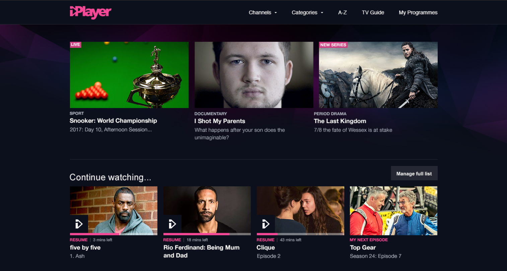

iPlayer - Futureproofing the home of British TV

iPlayer was created in 2007 as a way to catch up on TV you’d missed. Over time it became a place to discover new shows, too. However, in research sessions we saw that it wasn’t as easy to find something new as it should’ve been. 

The previous homepage

The main place for discovering something new, the homepage, was leaving people feeling confused. ‘It feels like a random jumble’, said one participant, whilst others speculated that the order was randomly generated.  

This meant many people ended up relying on the ‘Most Popular’ list, rather than being able to find something that truly fit what they were looking for. 

As well as research with the public, we talked to people internally to find out their frustrations. The editorial team felt restricted given a finite number of slots, and had no way to create curated collections of programmes.

Results from a co-design workshop

We ran co-design workshops both internally and with the public, letting people create their ideal homepage with printouts. From these we distilled four key pillars that people used to orient themselves. These were genres, boxsets, personalised lists and editorial collections.

Wireframe of the new slice structure

To future-proof the page, we built it on a framework of slices which could be swapped in and out and extended in the future. We A/B tested a few different types of slice and found that a carousel worked best.

<video width="100%" autoplay loop controls>
  <source src="{{page.imagesurl}}iPlayer_hover_states.mp4" type="video/mp4">
Your browser does not support videos.
</video>

Hover states, before and after

At the same time we have evolved the visual language of iPlayer. As well as refining the colour palette and tightening up the typography, we worked to make each programme component more compelling. 

As a result of our work the editorial team has more control to craft an exciting set of shows to dive into, and people spent far less time looking for something to watch.  

