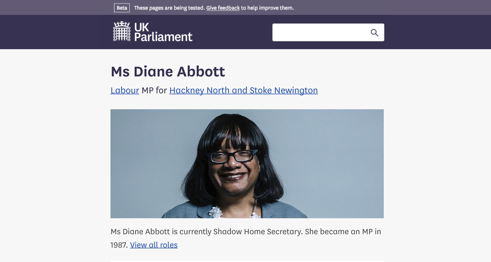

UK Parliament

Making it easier to understand what MPs and Lords do

Only a third of people say they understand how Parliament works, and even fewer say it does a good job representing their interests. Political disengagement is a broad, unwieldy problem. 

A graph I drew soon after joining

Our ambition with the redesigned UK Parliament website was to make a dent in that disengagement. Our working hypothesis was that by making it clearer what MPs and Lords are doing every day, it becomes clearer how they’re representing your interests (or not!).

Find your MP

We started by designing an easy way for you to find your MP. Postcode made sense for most, but we also included a few other ways, such as by region, for people who might not have a permanent address. 

MPs roles

From research we knew that most citizens had very little idea of their MPs role in Parliament. To address this, I worked with Alan (a content designer) to develop an algorithm that translates each MP’s list of job titles into a plain english sentence, shown at the top of their page. 

An MPs role timeline

An MPs role can shift and change over time. We tested a few designs with the aim of making it as easy as possible to grasp the ‘story’ of your MPs career in Parliament. We found that using a timeline enabled people to intuitively understand an MPs past. We designed alternative views for ‘professional’ users like journalists.

The first consistent portraits of MPs

Rather than rely on MPs to submit a photo of themselves, we saw an opportunity to take a coherent set of portraits - with the aim of showing a more human side to Parliament. We worked with Chris McAndrew to capture a set of photos with personality.

The most used crops, easily available

We wanted them to be as easy for anyone to access and use as possible. I researched the most frequently used crops of photos and, working with the data team, created a process by which these would be generated and made available for download, along with the original high-res photo.I also worked with our content designers to ensure our open license was easy to understand. 

MPs photos out in the wild

The photos were used by a plethora of different people and outlets, and made the news in their own right.

Flexible calling card component

We also developed a flexible 'calling card' component, using the photos, which was used across the site to point to MPs. This showed the role the MP holds which is most relevant to the information on the page.

Unfortunately in the end Parliament decided not to proceed with a website built in a user centered way. The beta website described in this post was deleted a few months later. There are many reasons this happened - mistakes were made, political landscapes misunderstood, but I hope that one day the loose strands described in this post will be picked up again. 

This work was completed as an interaction designer over 12 months, alongside other work, working closely with <a href="https://www.linkedin.com/in/marttiina-keituri-gilchrist-33641251/">Marttiina Keituri Gilchrist</a> and <a href="https://www.linkedin.com/in/alan-mayers-71849813a/"> Alan Mayers</a>.

